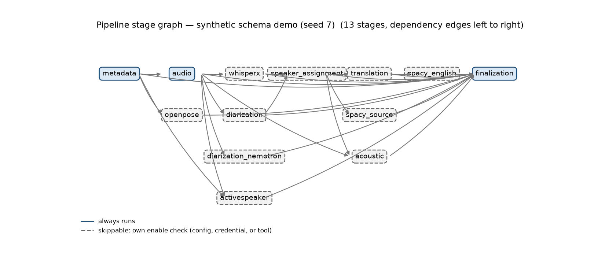
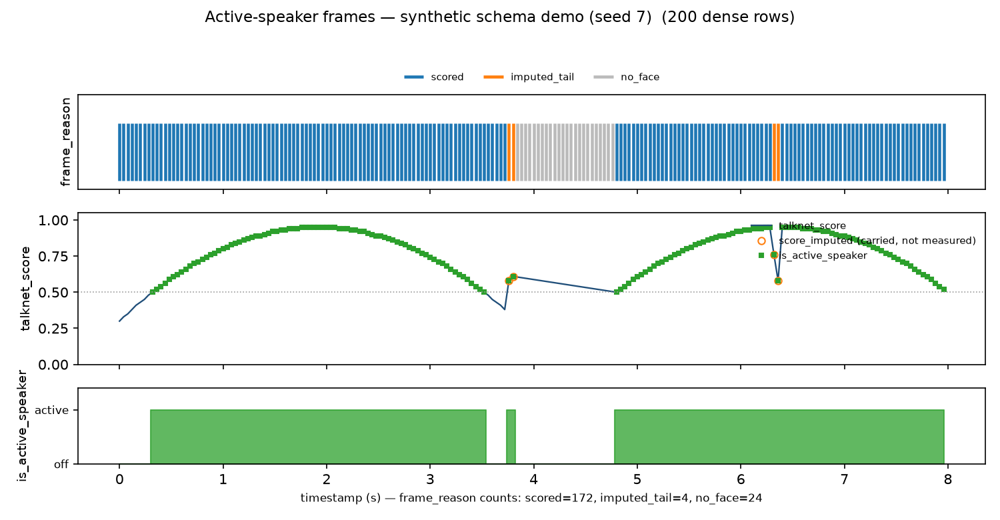
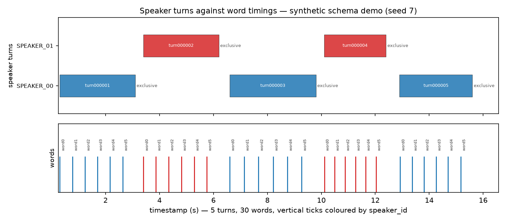
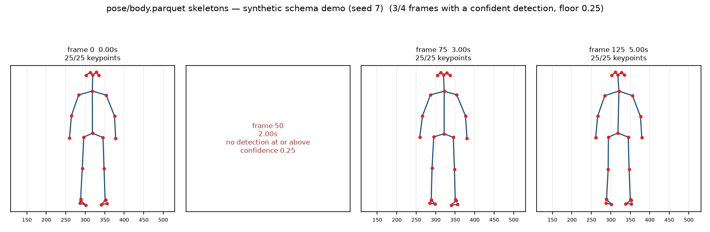

# multimodal-pipeline

Sequential, resumable multimodal video-processing pipeline.

Give it a directory of video recordings; it produces **one self-contained dataset
directory per video** containing media metadata, extracted audio, WhisperX
transcription with word-level alignment, Pyannote Community diarization, a
speaker-assigned transcript, an English translation through a LiteLLM
OpenAI-compatible endpoint, spaCy linguistic features (source language and
English), Praat/Parselmouth acoustic features and OpenPose BODY_25 + hands + face
keypoints — all normalised to Parquet on a single video timeline, with raw tool
artifacts, logs, status, provenance and a manifest.

Every modality lands on the same clock (`seconds_from_video_start`), so a query
like *"show me everything between 12.4 s and 15.1 s in video X"* is a filter, not
a join across five timestamp conventions.

---

## Quick start

```bash
uv sync --python 3.12                       # orchestrator (light dependencies only)
cp config/config.example.yaml config/config.local.yaml
$EDITOR config/config.local.yaml            # input/output dirs, model, endpoints
cp .env.example .env && $EDITOR .env        # credentials (optional: diarization, translation)
uv run multimodal-pipeline inspect-environment -c config/config.local.yaml
uv run multimodal-pipeline run -c config/config.local.yaml
```

Every command in this file is written as `uv run multimodal-pipeline …`. That is the
form that works with no activation step: `multimodal-pipeline` is a console script of
the root project, so the bare name is only on `PATH` inside an activated
`.venv/bin` (`source .venv/bin/activate`, or `uv shell`) — verified on a fresh clone,
where the bare command is not found. Use whichever form you prefer; they are the same
entry point.

`.env` at the project root is read automatically before the config is interpolated,
so a run needs no shell wrapper and no `source .env`. Variables you export yourself
always win over the file, which keeps CI secrets and one-off overrides working.

`inspect-environment` before a long run is worth the two seconds: it prints JSON on
stdout with the ffmpeg/OpenPose/GPU inventory it actually found. Its
`environment_warnings` name what will cost you data: missing `HF_TOKEN`, an
unconfigured translation endpoint, a missing OpenPose binary or input directory, an
absent uv project directory, a `talknet_root` that will make `activespeaker` skip, and
a missing English spaCy model (which would produce `linguistic/english/*` tables with
empty lemmas — the one language degradation knowable before a run, because English
linguistics always run on English text). Stages with a required install are not listed
because they do not skip — see
[Resume, reuse and invalidation](#resume-reuse-and-invalidation).

The six heavy tool environments live in their own uv projects and must be synced
separately. This is deliberate — see [Why six environments](#why-six-environments).

```bash
(cd environments/whisperx   && uv sync --python 3.12)
(cd environments/diarization && uv sync --python 3.12)
(cd environments/spacy      && uv sync --python 3.12)
(cd environments/acoustic   && uv sync --python 3.12)
(cd environments/activespeaker && uv sync --python 3.12)   # optional: TalkNet needs its own torch
(cd environments/diarization_nemotron && uv sync --python 3.12)  # optional: second diarizer, see below
scripts/install_spacy_models.sh             # language models you actually need
```

Then generate the test fixtures and run a smoke test end to end:

```bash
scripts/make_fixtures.sh                    # ~1 s, uses ffmpeg's flite TTS
uv run multimodal-pipeline process-video -c config/config.local.yaml data/input_videos/pipeline_demo.mp4
```

`make_fixtures.sh` needs the ffmpeg **`flite` filter**, which comes from libflite and is
missing from some packaged ffmpeg builds; when it is absent the script stops and says how
to check (`ffmpeg -filters | grep flite`) rather than dying inside a lavfi parse error. It
also verifies every fixture it writes with ffprobe (exists, ≥ 1 s, has both a video and an
audio stream), because `-shortest` makes the output as long as the shorter stream and an
ffmpeg that exits 0 on junk used to still print "generated …". The clip with a real person
is copied from your OpenPose install: the root is `--openpose-root`, else `openpose.root`
from the config given with `--config`, else from `config/config.local.yaml`, else the
schema default — the same setting the pipeline already uses, and it prints which one it
used. `pipeline_demo.mp4` is 9.985 s rather than the 14 s requested because that is how
long the synthesised speech is; `-shortest` then trims the video to match.

---

## Commands

| Command | What it does |
|---|---|
| `run` | Process every discovered video, sequentially, one stage at a time |
| `resume` | Continue an interrupted run, reusing every stage whose result is still valid |
| `retry-failed` | Force-recompute exactly the stages that failed, then their dependants |
| `process-video <file>` | Process one file by path (the smoke-test entry point) |
| `status` | Per-video, per-stage state. `--plan` explains every reuse decision, `--json` for scripts |
| `validate` | Re-run semantic validation over artifacts already on disk, without processing |
| `inspect-environment` | Discovered tools, models and GPU/CUDA versions — JSON on stdout, always, no flag needed |

Stage controls on `run`; `process-video` takes the same four stage controls and takes
the file as its positional argument instead of a flag:

```
--only-stage   acoustic              this stage plus whatever it needs
--from-stage   whisperx              start here
--to-stage     acoustic              stop here            (default: finalization)
--force-stage  whisperx,acoustic     recompute even if valid
--video        clip.mp4               one file (run only); a bare name resolves
                                     against input.directory
```

`status` and `validate` take `--json` for machine output, and `inspect-environment`
*is* JSON unconditionally; on all three, the human-readable tables go to **stderr**,
so `| jq` and CI capture work without scraping. (`inspect-environment --json` is not a
thing — it exits 2 with typer's "No such option", measured.)

Exit codes are part of the API:

| Code | Meaning |
|---|---|
| `0` | every video completed |
| `1` | `validate` found a broken artifact, or `status` was given an unknown video id |
| `2` | `run`/`resume` had at least one failed or partial video; or a config/usage error |

`run` uses `2` rather than `1` so a CI job can tell "a video needs attention" apart
from "the pipeline was invoked wrongly".

---

## What a dataset looks like

```
data/processed/<video_id>/
├── manifest.json                 ← programmatic entry point: every artifact + status
├── status.json                   ← per-stage state machine (resume reads this)
├── source/
│   ├── metadata.json             ← ffprobe: streams, rational frame rate, SHA256, tags
│   └── frame_index.parquet       ← frame_number → true PTS in seconds
├── audio/
│   ├── audio.wav                 ← 16 kHz mono PCM s16le (WhisperX/Pyannote/Parselmouth)
│   └── audio_info.json
├── speech/
│   ├── segments.parquet          ← segment_id, start/end, language, speaker_id, text
│   ├── words.parquet             ← word-level times, confidence, alignment_status
│   ├── speaker_turns.parquet     ← pyannote diarization (when available)
│   ├── speaker_turns_nemotron.parquet  ← second engine, if enabled (see below)
│   └── raw/{whisperx,diarization,exclusive_diarization,nemotron_diarization}.json
│       + diarization.rttm
├── translation/
│   ├── segments_en.parquet
│   └── raw/                      ← every raw response + per-batch cache
├── linguistic/
│   ├── source/{tokens,sentences}.parquet   + raw/spacy_source.json
│   └── english/{tokens,sentences}.parquet  + raw/spacy_english.json
├── acoustic/
│   ├── frame_features.parquet    ← timestamp, f0_hz, intensity_db, voiced, f1..f3_hz
│   ├── segment_features.parquet  ← per-segment aggregates + pause statistics
│   └── raw/acoustic_features.jsonl
├── pose/
│   ├── body.parquet              ← BODY_25 keypoints, one row per person/keypoint
│   ├── hands.parquet             ← 21 points × left/right
│   ├── face.parquet              ← 70 points
│   ├── raw/<video>_NNNNNNNNNNNN_keypoints.json   ← OpenPose's own output, untouched
│   └── raw_images/<video>_NNNNNNNNNNNNN_rendered.jpg   ← only with write_images: true
├── speaker/
│   ├── active_speaker_frames.parquet   ← one row per 25 FPS frame (dense, face_status, frame_reason)
│   ├── active_speaker_tracks.parquet   ← one row per TalkNet face track
│   └── raw/{active_speaker.json,tracks.pckl,scores.pckl,scenes.csv}
├── logs/                         ← pipeline.log + one log per stage
└── provenance/
    ├── config.json               ← resolved config, secrets masked, config hash
    ├── tools.json                ← tool + model versions, GPU/CUDA, OpenPose inventory
    └── processing.json           ← per-stage commands, hashes, durations, errors
```

Start from `manifest.json`. It lists every artifact as a path relative to the
dataset directory, plus `artifacts_not_generated` for what was legitimately
skipped — so an absent file is always *declared*, never silently missing.
`temporal_model` states the unit and which columns are intervals versus instants.

### Two layers on purpose

Raw tool output and normalized Parquet are both kept, and normalization is
rerunnable on its own (`--only-stage <stage>` with raw present). Re-deriving a
Parquet table costs seconds; re-running WhisperX large-v3 or OpenPose costs minutes.
Raw artifacts stay **byte-identical** to what the tool produced — provenance is
written to a sidecar (`*.provenance.json`) rather than stamped into the raw file.

### What a stage emits, as a picture

Four figures under [`docs/assets/`](docs/assets/README.md), drawn from the Parquet tables
themselves by `scripts/make_dataset_figures.py` — and built from a **synthetic** dataset,
never from processed video: the pipeline's real input is copyrighted broadcast material,
so no derived frame is committed here. The stage graph comes from `STAGE_ORDER` and
`STAGE_DEPENDENCIES` (dashed = the stage has its own enable check and may skip). The
active-speaker strip puts the dense frame table on one axis — ticks coloured by
`frame_reason`, the score trace, the `is_active_speaker` band — which is where "nothing
was measured" and "the last score was carried" finally look different from each other.






Regenerate all four (matplotlib is not a project dependency, so `--with` supplies it; the
output is byte-identical for a given seed, and a test asserts these committed bytes):

```bash
uv run --with matplotlib python scripts/make_dataset_figures.py --synthetic --seed 7 --out docs/assets
```

---

## Two diarization engines, on purpose

`speaker_turns.parquet` is pyannote. `speaker_turns_nemotron.parquet` is
`nvidia/Nemotron-3-Diarization`. They are **two independent measurements of the same
audio**, both produced when `diarization_nemotron.enabled` is true, so the choice of engine
can be made from evidence instead of from a blog post. Neither one replaces the other, and
`speaker_assignment` — the stage that labels transcript segments — reads **only** pyannote,
so enabling the second engine changes no existing label in any dataset.

Do not join the two tables on `speaker_id`. Pyannote emits `SPEAKER_00`, Nemotron emits
`speaker_0` ordered by arrival, and the numbers are unrelated: identical digits name
different people. Compare them by time overlap, not by label.

The shapes differ because the engines disagree about what a diarization is. Pyannote's
table here is the **exclusive** timeline — exactly one speaker per instant — because that is
what makes labelling a transcript segment well-defined. Nemotron's is **overlapping**: two
channels can be active at once, which is the feature the model exists for and which an
exclusive table cannot represent at all. So `speaker_turns_nemotron.parquet` carries
`overlap_s`: the seconds of that segment spent overlapping a *different* speaker's segment
(summed over all of them). `diarization_type` is `overlapping` in every row, so a reader
cannot mistake it for the other table.

What that disagreement looks like on real clips from this corpus, measured 2026-09-25:

| clip | pyannote (exclusive) | Nemotron |
|---|---|---|
| KABC, 4.20 s | 1 turn, 1 speaker | 3 segments, 2 speakers, 2 overlapping pairs |
| La1, 8.01 s | 2 turns, **1 speaker** | 4 segments, **2 speakers**, 2 overlapping pairs |

Two things worth knowing before reading that as a verdict. Nemotron found a second voice
where pyannote heard one — which is *also* the failure mode of an overlapping-speech model:
it can split one talkative speaker or promote background speech to a channel. And the
speed difference is far smaller than the raw inference time suggests. Nemotron's *inference*
is ~0.15 s per clip, but the worker is one process per video, so it pays a model load every
time: the two runs above recorded `load_seconds` of 1.55 and 1.22 against
`inference_seconds` of 0.148 and 0.153. Measured stage cost over this whole corpus, pyannote
took 37 s across 7 videos (5.3 s per video). So neither engine is the cheap one, and
"Nemotron is faster" is not a reason to prefer it. Two clips is not a comparison either.
Run the stage over the corpus you care about and read the tables; `status --plan` will tell
you it is the only stage that reruns.

Enabling it costs a separate uv environment and a model download, and the environment pin
is an unreleased `transformers` commit — see
[Why six environments](#why-six-environments). If the environment is absent the stage
*skips* with the reason naming the fix, and the corpus still completes, because a second
opinion is not a prerequisite.

---

## Stage graph

```
metadata
  ├─ audio
  │    ├─ whisperx ────┐
  │    ├─ diarization ─┴─ speaker_assignment
  │    │                                  ├─ translation ── spacy_english
  │    │                                  ├─ spacy_source
  │    └─ acoustic ◄──────────────(also)──┘
  ├─ openpose                     (metadata only — no audio, no transcript)
  └─ activespeaker                (metadata + audio — independent of the transcript)

  metadata, audio, whisperx, diarization, speaker_assignment, translation,
  spacy_source, spacy_english, acoustic, openpose, activespeaker  ──►  finalization
```

`openpose` depends only on `metadata`, so a transcription failure never stops pose
extraction — verified: with whisperx failing, `openpose` completed while the speech
chain reported `upstream stage failed: whisperx`. Propagation is **per branch**: a
stage is blocked only by a failed stage in its own dependency chain, and a *skipped*
prerequisite (disabled, or a missing credential) is not a failure — `speaker_assignment`
degrades with its own reason instead of poisoning the run, so a dataset without a
Hugging Face token still gets transcript, linguistics, acoustics and pose.

OpenPose can also emit the rendered skeleton frames it draws, and it is **off by
default**: `openpose.write_images: true` adds `--write_images pose/raw_images` plus the
per-module switches this build actually exposes (`--render_pose -1` to inherit, and
`--face_render` / `--hand_render`, each following `face.enabled` / `hands.enabled`), so
body, hand and face skeletons land in one pass over the frames OpenPose already
computed. Set it deliberately: both it and `image_max_side` are hashed into the
`openpose` fingerprint, so enabling them re-runs the slowest stage on every dataset you
already produced. And bring disk space — OpenPose's own `--output_resolution` default is
`-1x-1`, full input resolution, which is hundreds of MB to several GB per video; give
`image_max_side` a pixel budget (640 is enough to read a pose) or the stage logs the
warning once and renders at source size anyway. What comes back is a *view*, not data:
`pose/*.parquet` stays the measured keypoints, the JSON in `pose/raw/` stays
byte-identical, and a run that was asked to render and wrote zero images fails loudly
instead of completing an empty dataset. Capping the render does not rescale the data:
measured on a 1280×720 clip with `image_max_side: 640`, the images came back 640×360
while `--keypoint_scale` kept its default and the JSON coordinates still reached x≈1223
— so the tables stay in source pixels and the images are a downscaled view of them
(exit 0, 205 frames, 205 images, 31 MB).

`activespeaker` answers a question the audio-only stages cannot: **which visible face
is producing the audio**. Pyannote says when someone speaks and OpenPose says where
bodies are; only TalkNet connects the two. Its frames table is deliberately **dense**
— exactly one row per 25 FPS frame of its working timeline, including frames where no
face was found — and every row also carries the nearest original-video timestamp,
because TalkNet thinks in constant-rate 25 FPS and the rest of the dataset does not.

Each frame carries `face_status`: `no_face` (nothing located), `tracked` (a face with a
score), or `tracked_unscored` (S3FD located a face, TalkNet had no measurement for it).
The third state matters: collapsing it into `no_face` would report "we could not score
this person" as "nobody was here", and a reader would draw the opposite conclusion from
the same null. A malformed bounding box is still dropped rather than invented — a
meaningless box is not a location.

`frame_reason` answers the next question, *why* the row does or does not carry a score,
because four different causes otherwise produce byte-identical rows. It is set by the
worker at the branch that knows (neither a frame's position inside its track nor the
track's score count survives into the table, so nothing downstream could recover it):

| `frame_reason` | Meaning |
|---|---|
| `scored` | a face was located and TalkNet produced a finite score for it |
| `imputed_tail` | the score is the last real score carried over the bounded tail — `score_imputed` is `true` and the value was not measured |
| `no_face` | no face was located in this frame at all (the only reason that pairs with `face_status = no_face`) |
| `score_not_finite` | a score existed at this position and was NaN or infinite |
| `track_has_no_scores` | the track produced zero scores, so there was nothing to carry |
| `past_scored_tail` | the frame sits beyond the last score plus the two-frame carry window |
| `tail_score_not_finite` | inside the carry window, but the value available to carry was not finite |
| `unknown` | only for raw artifacts written before this field existed, where the cause cannot be recovered — never a guess at one of the four above |

| Stage | Runs | Needs |
|---|---|---|
| `metadata` | ffprobe + SHA256 | ffmpeg |
| `audio` | ffmpeg → 16 kHz mono | ffmpeg |
| `whisperx` | uv env worker | GPU (or CPU), model download on first use |
| `diarization` | uv env worker | `HF_TOKEN` + pyannote community-1 EULA |
| `diarization_nemotron` | uv env worker (Nemotron 3) | optional second engine; its uv env + model download |
| `speaker_assignment` | in-process interval math | diarization output |
| `translation` | OpenAI-compatible HTTP | `translation.base_url` / `api_key` / `model` |
| `spacy_source` | uv env worker | spaCy model for the detected language |
| `spacy_english` | uv env worker | translation output + `en` model |
| `acoustic` | uv env worker (Parselmouth) | audio |
| `openpose` | `/opt/openpose` binary | OpenPose install + models, GPU |
| `activespeaker` | uv env worker (TalkNet-ASD) | TalkNet checkout + `environments/activespeaker` |
| `finalization` | in-process | everything above |

What happens to a stage whose prerequisites are absent depends on **which kind of
prerequisite is missing**, and the distinction is deliberate — measured, not styled:

1. **A choice you can opt out of** (disabled section, missing credential, unconfigured
   endpoint): the stage is **skipped with a reason** — `missing credential HF_TOKEN
   (export it to enable diarization)`. `status --plan`, the batch report and
   `validate` echo those reasons. The rest of the dataset is still produced and still
   valid.
2. **An install you explicitly asked for**: the stage **fails** with the fix in its
   message. With `openpose.enabled: true` and a wrong `openpose.root`, the run ends
   `openpose: OpenPose binary not found under … Set openpose.executable explicitly`
   (verified on this machine against a nonexistent root: `status.json` records
   `failed`, the video is `partial`, exit code 2). Same for a missing uv environment:
   `whisperx worker failed: uv project not found: … Create it and run \`uv sync\` there
   first.` Skipping instead would turn a broken install into a silently incomplete
   dataset — an operator who enabled a stage asked for its data or for an error, not a
   shrug.
3. **A stage blocked by a failed upstream** is *skipped* with
   `blocked by failed upstream: whisperx` (per-branch, as described above) — that skip
   is bookkeeping for the run, not a claim that the stage was configured wrong.

---

## Configuration

`config/config.example.yaml` is the documented template (a test loads it, so it
cannot drift from the schema). Values support `${VAR}` and `${VAR:-default}`
environment interpolation, so credentials stay out of the file. Unknown keys are
rejected with the valid names listed:

```
error: invalid configuration (config/config.local.yaml):
  logging.capture_subprocess_output: unknown setting (known: console, level,
progress_interval_seconds)
```

The interesting sections:

```yaml
input:    {directory: /data/input_videos, recursive: false}
output:   {directory: /data/processed}
execution: {mode: sequential, gpu: 0, stop_on_video_error: false}

whisperx:
  model: large-v3          # any Whisper arch
  language: auto           # or an ISO code to force it
  device: cuda             # cpu works, slowly
  compute_type: float16

diarization:
  pipeline: pyannote/speaker-diarization-community-1
  hf_token_env: HF_TOKEN   # the *variable name*; its value is never written
  num_speakers: null       # or min_speakers / max_speakers to constrain it

translation:               # any OpenAI-compatible endpoint (LiteLLM in particular)
  base_url: ${LITELLM_BASE_URL:-http://LITELLM_HOST:PORT/v1}
  api_key: ${LITELLM_API_KEY:-}
  model: ${LITELLM_MODEL:-}
  batch_size: 10           # segments per request
  context_segments: 2      # neighbours sent as context, never re-translated

spacy:
  english_model: en_core_web_lg
  source_models: {en: en_core_web_lg, es: es_dep_news_trf, ...}
  fallback_model: blank    # any language still gets tokens + sentences
  trust_low_language_detection: true   # false = no full pipeline on a shaky detection

acoustic:
  time_step: 0.01          # 10 ms, Praat's default pitch granularity
  pitch_floor: 75.0
  pitch_ceiling: 500.0
  chunk_seconds: 120.0     # bounded memory on long recordings

openpose:
  root: /opt/openpose      # binary and models are discovered under here
  body: {enabled: true, model: BODY_25}
  hands: {enabled: true}
  face:  {enabled: true}
```

Install only the spaCy models whose language you actually expect. `spacy_model` in the
output table records which one ran, and `blank` is a degradation you can see. A *wrong*
model is worse, because it looks like a result: on Spanish text, `ca_core_news_lg`
labelled `Muy buena entrada` as three `PROPN` tokens with the first as `ROOT` and
plausible dependencies attached, where the blank pipeline's empty lemmas were at least
honest about knowing nothing. Resolution goes configured language → same family → any
installed model → blank, so an installed model *will* be picked up for a language it
does not serve. Either install the model that matches the language or leave that family
out and accept `blank`.

Installing or removing a model invalidates the linguistics stages instead of leaving
them serving a cached `blank` result: which models exist changes the output as much as
the configuration does.

#### How far to trust the detected language

The language the resolver is handed is WhisperX's *detection*, and WhisperX grades its
own work: `speech/raw/whisperx.json` carries `language_detection` with status
`configured` (you pinned `whisperx.language`), `ok`, or `low` — `low` when the audio is
shorter than WhisperX's 30 s detection window or the probability is missing or below
0.5. `spacy.trust_low_language_detection` decides what `spacy_source` does with `low`.

**`true` (default)** keeps the model the detection selected and logs a warning naming the
language, the probability, the model that was still chosen, and the key that reverses it:

```text
language 'es' was auto-detected with low reliability (probability 0.88; audio is 8.0s,
below the 30s detection window); the full pipeline for it was still selected
(model='es_core_news_lg', status='configured') because
spacy.trust_low_language_detection = true — set spacy.trust_low_language_detection =
false to require a trustworthy detection before building the linguistic layer.
```

Both texts are copied from what the worker logs, not paraphrased.

The default is `true` because the grade is pessimistic on short clips: on this
pipeline's corpus every auto-detected clip is `low` — seven out of seven, because every
clip is under 30 s — and the resulting choice is measurably correct where it was checked
(Spanish lemmas from a real Spanish pipeline on the Spanish clip, `en_core_web_lg` on the
English ones). Demoting `low` unconditionally would take the linguistic layer off the
only Spanish clip in the corpus on the strength of a grade that never says `ok` here.

**`false`** refuses to build a full linguistic layer on a sub-window guess. No language
reaches the resolver, so it reports what it can do without one and the raw document says
so (`model_selection_status: fallback_no_model`, model `blank`, capabilities
tokenisation + sentencizer — no lemmas, POS tags or dependencies). The warning names the
demotion and the key that reverses it:

```text
language 'es' was auto-detected with low reliability (probability 0.88; audio is 8.0s,
below the 30s detection window). spacy.trust_low_language_detection = false, so the
detection was not used to choose a model: the source variant was demoted to model='blank'
(status='fallback_no_model', capabilities=tokenization,sentencizer), which still yields
tokens and sentences but no lemmas, POS tags or dependencies. Set
spacy.trust_low_language_detection = true to accept a low-confidence detection again.
```

Both branches record the decision in provenance — `language_reliability` (the grade
itself, or `{"status": "absent"}`) and `language_reliability_trusted` — in
`linguistic/source/raw/spacy_source.json` and in the worker result. `spacy_english` is
excluded: it forces `en`, so it has no detection to trust and never sees the grade.

If no grade is available — a dataset produced before WhisperX graded anything, or a raw
file that could not be read — the model choice is left exactly as it was and the worker
warns that reliability could not be checked. A missing check is never reported as a
passed one.

### Secrets

Credentials live in an untracked `.env` at the project root — never in the YAML.
A config file gets copied between machines and pasted into issues; a pipeline whose
secrets are embedded in it leaks every time someone shares their config. The YAML
references them as `${VAR}` / `${VAR:-default}` and `load_config` reads `.env` first:

```bash
HF_TOKEN=hf_...                      # pyannote community-1 (accept its EULA first)
LITELLM_BASE_URL=https://host/v1     # any OpenAI-compatible endpoint
LITELLM_API_KEY=sk-...
LITELLM_MODEL=chat
```

`.env.example` is the committed template with fake values. Precedence is
environment-over-file on purpose: a stale `.env` from another account can never
shadow an explicit `HF_TOKEN=... uv run multimodal-pipeline run` or a CI secret. A
malformed line names itself (`.env:2: expected KEY=value`) and exits 2 rather than
raising a traceback. `MULTIMODAL_PIPELINE_NO_DOTENV=1` skips the implicit read —
that is what keeps the test suite independent of the credentials on your machine.

Anything matching `token|key|secret|password` is then replaced with `***masked***` in
logs, `status.json`, manifests, provenance and the batch report. Keys that *name*
where a secret lives (`hf_token_env: HF_TOKEN`) survive masking on purpose — the
variable name is documentation, its value is not. An e2e test greps every file a
run writes for two planted credentials and fails if either appears.

---

## Resume, reuse and invalidation

`status.json` is the only source of truth for resume. A stage reuses its previous
result only when **all five** hold:

1. its status is `completed`;
2. its own `config_hash` is unchanged (stage config + resolved tool identity + source identity);
3. its `dependency_hash` is unchanged — every transitive upstream stage's config **and** execution sequence;
4. all its output artifacts exist;
5. they pass its own `validate()`, and each Parquet output still has the row count
   it had when the stage completed.

`status --plan` runs the same decision function as `run`, so what it reports is
what will happen:

```
   metadata             valid previous result
   whisperx             configuration changed
   diarization          disabled: missing credential HF_TOKEN (export it to enable diarization)
   speaker_assignment   disabled: diarization produced no speaker turns
   acoustic             outputs changed: frame_features.parquet has 900 rows, 1001 when validated
```

Two details that took real debugging to get right:

- **Sequence numbers, not mtimes.** This filesystem rounds mtimes to ~16 ms, so a
  stage that reran quickly looked unchanged and left stale Parquet behind. Each
  video carries a monotonic `run_sequence`; a dependant goes stale when an upstream
  stage's sequence moves, even with identical configuration (`--force-stage`, or a
  crash mid-write).
- **A stage must not invalidate itself.** `finalization` writes the manifest, so
  folding artifact sizes into its fingerprint made every later run rewrite the
  whole summary, forever. Fingerprints cover only what a stage does not write.

`--force-stage` recomputes the named stages and everything downstream of them, and
nothing else. A completed run's rerun costs ~0 s.

---

## Why six environments

whisperx pins `torch~=2.8.0`, pyannote.audio pulls its own transformers/torchcodec
combination, TalkNet needs an *older* torch than both, spaCy wants neither, and the
orchestrator should import none of them.
Installing everything together produces an unsatisfiable resolution or — worse — a
"working" resolution where one tool silently gets another's CUDA build.

So each heavy tool is its own uv project, invoked as
`uv run --project environments/<x> python workers/<x>.py`. The orchestrator imports
no `torch`, `pyannote` or `spacy`; a worker's environment can be rebuilt without
touching the pipeline. Verified pins on this machine:

| Env | Pins |
|---|---|
| `whisperx` | whisperx 3.8.6, torch 2.8.0 **+cu126**, torchaudio 2.8.0, torchvision 0.23.0 |
| `diarization` | pyannote.audio 4.0.7, torch 2.8.0, **torchcodec 0.7.0** |
| `spacy` | spaCy 3.8.16, pyarrow ≥17 |
| `acoustic` | praat-parselmouth 0.4.7 (Praat 6.1.38), numpy ≥1.26,<3 |
| `activespeaker` | **torch 2.5.1 +cu124**, torchvision 0.20.1, facenet-pytorch 2.5.3, scenedetect 0.6.5, numpy 2.0.2 |
| `diarization_nemotron` | **torch 2.8.0 +cu128**, transformers from git `5880561a`, librosa 1.0.0, accelerate 1.15.0 |

`diarization_nemotron` is the one pin that is **not a release**. NVIDIA ships
`nvidia/Nemotron-3-Diarization` two ways, and only one of them runs here: NeMo 3.0.0
cannot load the checkpoint at all (`self_attention_model='rope' is not supported`), and no
*released* `transformers` contains the architecture yet. So the environment pins an exact
commit of `transformers` from git — reproducible, but unreleased by construction. When a
release contains `nemotron3_diarization`, swap the git source for a version pin and expect
the Nemotron artifacts to be invalidated and recomputed. Full probe table:
`environments/diarization_nemotron/pyproject.toml`.

Three pins exist because of specific failures, not taste: the driver here is 555.42.06
(CUDA 12.5) and cu126 wheels are what was verified on it; latest `torchcodec` ships a
CUDA-13 build that dies with `libnvrtc.so.13`; and TalkNet cannot take a modern torch
because `talkNet.py` and its S3FD detector call `torch.load()` without `weights_only=`,
whose default flipped to `True` in torch 2.6 and rejects the project's 2021
checkpoints. That last one is why `activespeaker` is on cu124 while `whisperx` and
`diarization` are on cu126, and why `diarization_nemotron` was resolved separately on
cu128: cu128 is the build that was measured working for this model on this driver, and the
other three environments were never re-resolved to match it.

TalkNet is also the one stage whose model lives *outside* this repository: point
`activespeaker.talknet_root` at a checkout, and the two checkpoints either download
themselves into it or come from `activespeaker.weights_dir` if you keep the checkout
read-only. Unset, the stage skips with a reason naming the setting.

The `mock` translation provider (`translation.provider: mock`) lets you exercise the
whole graph, English linguistics included, with no network and no credentials.

---

## Testing

```bash
uv run --with pytest pytest tests/unit -q     # 957 tests, ~30 s
uv run --with pytest pytest tests/e2e -q      # 42 tests, ~110 s (needs ffmpeg + uv)
```

Unit tests avoid mocks wherever a mock would hide the bug: media tests call real
ffmpeg/ffprobe (including the NTSC `30000/1001` case), translation tests drive a real
threaded `HTTPServer` so status codes, timeouts and retry timing are actually
exercised, the uv-worker tests build a throwaway uv project so the trust boundary is
real, and OpenPose normalization runs against a real frame JSON captured from the
binary.

`tests/e2e/test_cli_smoke.py` invokes the `multimodal-pipeline` command as a
subprocess against a real on-disk project, because exit codes and stream routing are
part of the API: it asserts a corrupted file in the input directory fails *that*
video without stopping the batch, that killing a run mid-stage never leaves the
in-flight stage `completed`, that a second run rewrites nothing, and that no
credential reaches any written file.

Mutation-checked behaviour (restoring the defect fails a test): resume invalidation,
per-branch failure propagation, artifact integrity, the cross-modal checks, secret
masking, and the manifest's promise that every listed artifact exists.

---

## Troubleshooting

| Symptom | Cause and fix |
|---|---|
| `diarization ... missing credential HF_TOKEN` | Put `HF_TOKEN=...` in `.env` and accept the model's EULA on Hugging Face. Everything except speakers and English linguistics still runs without it. |
| `translation endpoint is not configured` | Set `translation.base_url`/`api_key`/`model` (or `provider: mock` to test the graph). |
| `uv project not found: .../environments/whisperx` | Run `uv sync --python 3.12` in that environment directory. |
| `libnvrtc.so.13` on import | `torchcodec` drifted past 0.7.0. Re-pin and re-sync the diarization env. |
| `OpenPose binary not found under /opt/openpose` | Check `openpose.root`; `inspect-environment` prints the resolved path. |
| Everything reruns after one config edit | Expected: `--only-stage X --force-stage X` reruns X and its dependants only. Check `status --plan` for the named reason. |
| `pose/*.parquet` have 0 rows | The video contains no person. That is a valid outcome; the raw JSON in `pose/raw/` confirms it. |
| `activespeaker.talknet_root is not set` | Clone TalkNet-ASD and set `activespeaker.talknet_root`. Without it the stage skips and the rest of the dataset is unaffected. |
| `activespeaker.talknet_root has no run_talknet.py` | That path is not a TalkNet-ASD checkout — the stage checks for the entrypoint rather than letting a confusing `torch.load` error surface minutes later. |
| TalkNet dies with an unpickling or `weights_only` error | The environment drifted past torch 2.5. Re-sync `environments/activespeaker`; the pin is load-bearing (see [Why six environments](#why-six-environments)). |
| `speaker/active_speaker_frames.parquet` has rows with `track_id = null` | No face was detected in those frames — off-screen, back-turned, or too small. S3FD tracks near-frontal faces only; a person walking away legitimately loses the track. Absence is recorded as a row, not dropped. `frame_reason = no_face` says the same thing from the score side. |
| `score_imputed = true` on some frames | TalkNet scores fewer frames than it tracks (an unexplained `-1` in its MFCC windowing), so the last score was carried forward rather than measured. At most two frames per track are affected; treat those as unmeasured, not as low confidence. `frame_reason = imputed_tail` names the same rows. |
| A frame has `face_status = "tracked_unscored"` | S3FD located a face there but TalkNet produced no usable score for it. `frame_reason` names which of the four causes: `score_not_finite` (a score existed and was NaN/inf), `track_has_no_scores` (the track never produced one), `past_scored_tail` (beyond the two frames that may be imputed), or `tail_score_not_finite` (inside the window, the value to carry was broken). The scores stay `null` and the frame is never active — this is "we could not measure", not "nobody was on screen" and not a confidence of zero. |
| A frame has `frame_reason = "unknown"` | That table was normalised from a raw artifact written before the field existed, so the cause is not recoverable. Rerun `activespeaker` to get a diagnosed table. |
| `acoustic/segment_features.parquet` is empty | No voiced audio (silent track, or music with no speech-like f0). |
| `avg_segments_confidence` is negative | WhisperX reports log-probability-derived segment confidence; word confidences are the 0–1 ones. |

---

## Repo layout

```
src/multimodal_pipeline/   orchestrator: config, discovery, DAG, state, CLI, normalization
workers/                   heavy ML entry points, run inside the isolated envs
                         (whisperx, diarization, nemotron diarization, spacy,
                         acoustic, activespeaker)
environments/              one uv project per dependency-heavy tool
config/                    example template (committed) + local config (ignored)
tests/unit/                957 tests
tests/e2e/                 42 CLI-driven tests
scripts/                   fixture + spaCy model installers, dataset figure renderer
docs/assets/               committed figures (synthetic-schema demos, regenerable)
odd/tasks/                 Gentle-AI ODD feature document (decisions, evidence)
data/input_videos/         synthetic fixtures (committed, ~330 KB)
```

`data/processed/` and `data/input_videos/person_demo.avi` are deliberately not
version-controlled: the datasets are fully regenerable, and the person clip is
OpenPose's own example media, copied on demand by `scripts/make_fixtures.sh`.

## License

MIT. The `LICENSE` file is the text; `pyproject.toml` declares the same SPDX
identifier, so the machine-readable and human-readable declarations agree.
