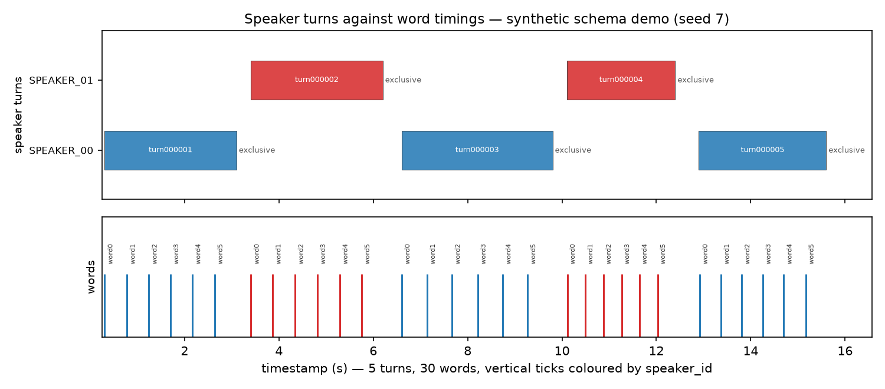
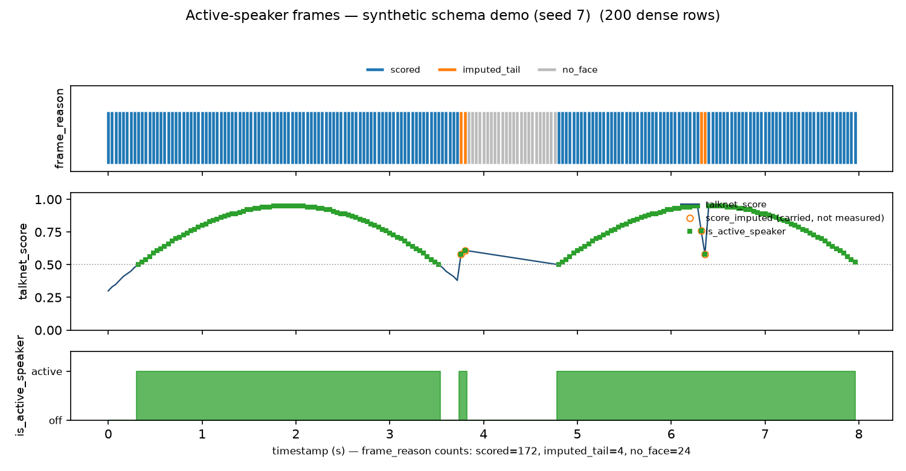
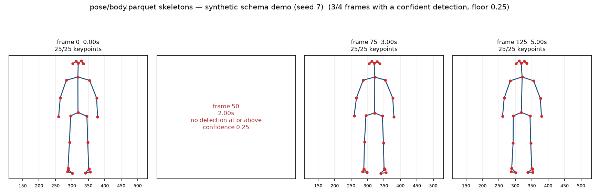

# Storytel Pipeline

**From video recordings to traceable, time-aligned multimodal datasets.**

Transcribe speech, compare diarization engines, extract acoustic and visual features,
and inspect the results in ELAN — with one dataset directory per video, normalized
Parquet tables, original tool output and processing provenance.

[Get started](docs/getting-started.md) · [Explore a dataset](docs/datasets.md) ·
[ELAN guide](docs/elan.md) · [CLI reference](docs/cli.md)



*An illustration of the output schema, not a real recording or an ELAN screenshot.
All figures on this page use synthetic data; no broadcast frames are redistributed.*

## Why this pipeline?

- **One shared timeline.** Times are expressed in seconds from the source video's
  start, with explicit mappings between source frames and working grids.
- **Resume instead of restart.** Reuse validated stage outputs; recompute only what
  changed and the stages that depend on it.
- **Keep the evidence.** Raw tool artifacts sit beside normalized tables, logs,
  configuration fingerprints and tool/model provenance.
- **Inspect, don't guess.** Missing prerequisites and skipped stages carry reasons;
  an empty result is distinguishable from an analysis that never ran.
- **Isolate heavy dependencies.** Seven separate `uv` environments keep incompatible
  ML stacks out of the lightweight orchestrator.

Execution is sequential: one video and one stage at a time. The console command is
`multimodal-pipeline`; the project title does not change the CLI name.

## What you can extract

| Layer | Tools and outputs |
|---|---|
| **Speech** | WhisperX transcription and word alignment; pyannote speaker turns; optional Nemotron diarization for comparison |
| **Language** | Segment-level English translation through an OpenAI-compatible endpoint; spaCy tokens, lemmas, POS tags and dependencies when a trained model is available |
| **Acoustics** | Praat/Parselmouth pitch, intensity and formants, plus per-segment aggregates and pause statistics |
| **Pose** | OpenPose BODY_25, hand and face keypoints; a separate body-centred pose transform |
| **People and speakers** | Optional YOLO person tracking, TalkNet active-speaker detection and audio–visual agreement tables |
| **Narrative windows** | LLM-generated story candidates with transcript evidence, retained responses and explicit empty answers |
| **ELAN** | A linked `.eaf` with up to 15 fixed summary tiers, plus an HTML viewing aid and a shareable bundle builder |

Each layer depends on its own configuration and prerequisites. The
[modality guide](docs/modalities.md) explains the measurements and their limits;
[architecture](docs/architecture.md) explains dependencies, failure propagation and reuse.

## Quick start

> **Before running:** install `uv`, `ffmpeg` and `ffprobe`, then prepare the isolated
> environments for the stages you enable. OpenPose needs a separate installation;
> diarization and LLM stages have their own credential/endpoint requirements.
> Follow the [full installation guide](docs/getting-started.md#install-from-nothing)
> on a new machine — syncing the root project alone does not install the ML tools.

Run from the repository root:

```bash
uv sync --python 3.12
cp config/config.example.yaml config/config.local.yaml
cp .env.example .env
$EDITOR config/config.local.yaml    # input/output paths, stages and endpoints
$EDITOR .env                        # optional credentials; never commit this file
uv run multimodal-pipeline inspect-environment -c config/config.local.yaml
uv run multimodal-pipeline run -c config/config.local.yaml
```

These copy commands are for a fresh setup: keep an existing local config or `.env`
instead of overwriting it. Python 3.12 is shared by all seven environment ranges.
The `.env` file is read automatically; explicitly exported variables take precedence.

Inspect a completed run or find out why a stage will rerun:

```bash
uv run multimodal-pipeline status -c config/config.local.yaml --plan
uv run multimodal-pipeline validate -c config/config.local.yaml --json
```

For the complete command set, stage-selection flags and exit codes, see the
[CLI reference](docs/cli.md#commands). Configuration and troubleshooting live in the
[configuration guide](docs/configuration.md).

## Inside each dataset

```text
data/processed/<video_id>/
├── manifest.json       # artifact paths and declared absences
├── status.json         # per-stage state and reuse fingerprints
├── speech/             # segments, words and speaker turns
├── translation/        # English segment translations
├── linguistic/         # source/English token and sentence tables
├── acoustic/           # Praat frame features and segment summaries
├── pose/               # measured keypoints and normalized coordinates
├── persons/            # person detections and track summaries, when enabled
├── speaker/            # active-speaker evidence and fusion tables
├── stories/            # narrative candidates, when produced
├── elan/               # linked annotation export
├── source/ & audio/    # metadata, source-frame timings and extracted audio
└── logs/ & provenance/ # how each result was produced
```

Start with `manifest.json`, not a guessed filename. The
[dataset guide](docs/datasets.md#one-dataset-file-by-file) walks a processed example,
then shows how to read Parquet with Arrow or pandas and join modalities safely.

### A visual look at the schema

| Active-speaker evidence | Pose keypoints |
|---|---|
|  |  |
| Measured scores, carried scores and missing faces are separate states. | A missing detection stays missing; no skeleton is invented. |

*These are synthetic schema illustrations, not accuracy benchmarks. Open an image
at full size for the labels; generation details are in the [asset notes](docs/assets/README.md).*

## Read the results with their limits

- **Translation is not linguistic glossing.** The ELAN `gloss_en` tier contains
  segment-level English translations, not Leipzig interlinear glosses. There is
  no transliteration or gaze-estimation stage.
- **Tracks are not identities.** Face tracks, person tracks and each diarizer's
  speaker labels are different namespaces. Matching digits do not identify a person.
- **A shared unit is not a shared frame grid.** TalkNet uses its own 25 FPS grid;
  use source timestamps when joining it to source-frame measurements.
- **ELAN is a summary, not the full dataset.** Its coverage inventory states what
  was exported, summarized, left out or absent. Linguistic tables, dense pose
  coordinates and story candidates remain outside the tier export.
- **Story candidates are unvalidated claims.** Transcript-bound evidence makes
  them auditable; it does not establish detection accuracy.

See the [consumer invariants](docs/datasets.md#the-invariants-a-consumer-may-rely-on)
and [ELAN semantics](docs/elan.md#elan-export-elan) before interpreting a bar as a measurement.

## Documentation

| I want to… | Guide |
|---|---|
| Install the tools and process my first video | [Getting started](docs/getting-started.md) |
| Run, resume, select stages or validate outputs | [CLI reference](docs/cli.md) |
| Understand the files and analyze their tables | [Datasets and analysis](docs/datasets.md) |
| Interpret diarization, fusion, pose, people or stories | [Modalities](docs/modalities.md) |
| Inspect annotation tiers or send an ELAN bundle | [ELAN export](docs/elan.md) |
| Understand dependencies, timing, reuse and environments | [Architecture](docs/architecture.md) |
| Configure endpoints, protect secrets or diagnose a failure | [Configuration and troubleshooting](docs/configuration.md) |
| Run tests and navigate the source tree | [Development](docs/development.md) |

## License

[MIT](LICENSE). This license covers the repository; it does not grant rights to
third-party input media, model weights or external tools.
